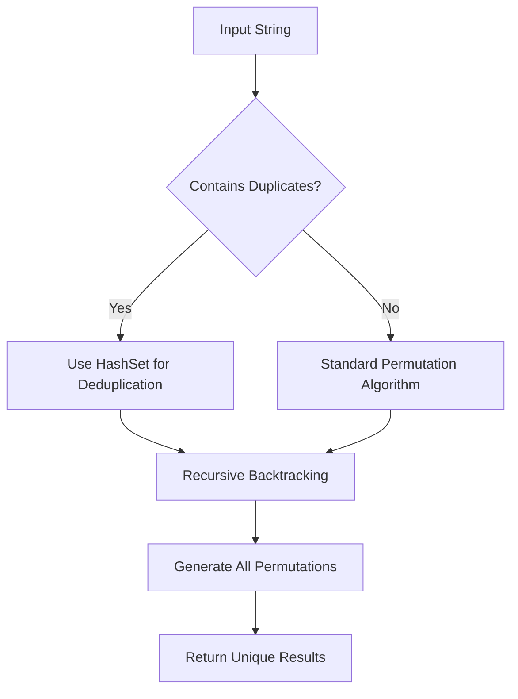
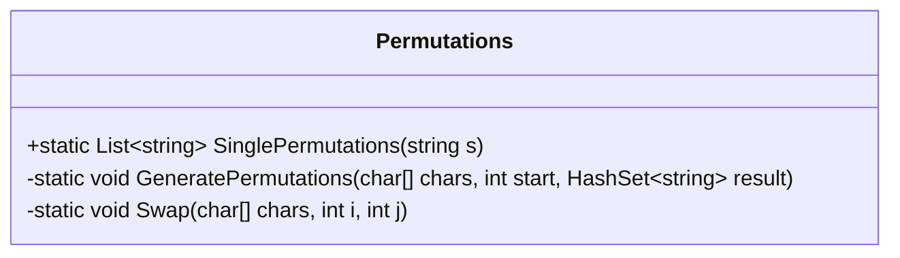
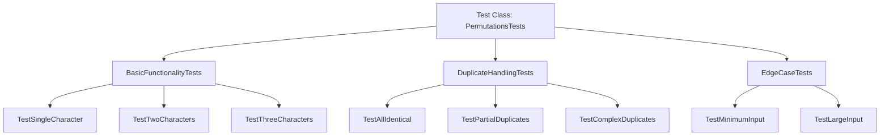

# String Permutations Generator Design

## Overview

Design and implement a C# function that generates all unique permutations of a non-empty input string. The function should handle duplicate characters efficiently by removing duplicate permutations from the result set.

**Core Requirements:**

- Generate all possible permutations of input string characters
- Remove duplicate permutations when input contains repeated characters
- Return results as `List<string>`
- Handle edge cases (single character, empty input)

## Architecture

### Repository Type

**Other Project** - Simple C# utility function/algorithm implementation

### Technology Stack

- **Language:** C# (.NET Framework/Core)
- **Collections:** `List<string>`, `HashSet<string>`
- **Algorithms:** Recursive backtracking with duplicate handling

## Algorithm Design

### Approach Analysis



### Core Algorithm Components

#### 1. Permutation Generation Strategy

**Recursive Backtracking Approach:**

- Convert string to character array for manipulation
- Use recursive function to swap characters at each position
- Generate permutations by fixing one character and permuting the rest
- Backtrack after each recursive call to restore original state

#### 2. Duplicate Handling Strategy

**HashSet-Based Deduplication:**

- Use `HashSet<string>` to automatically handle duplicates
- Add each generated permutation to HashSet
- Convert HashSet back to List for return value

### Data Flow Architecture

```mermaid
flowchart LR
    A[Input String 'aabb'] --> B[Convert to char[]]
    B --> C[Initialize HashSet]
    C --> D[Start Recursive Generation]
    D --> E[Generate Permutation]
    E --> F[Add to HashSet]
    F --> G{More Positions?}
    G -->|Yes| D
    G -->|No| H[Convert to List]
    H --> I[Return Results]
```

## Implementation Design

### Class Structure



### Method Specifications

#### Primary Method: `SinglePermutations`

**Signature:** `public static List<string> SinglePermutations(string s)`

**Responsibilities:**

- Input validation and edge case handling
- Initialize data structures for permutation generation
- Coordinate the permutation generation process
- Return final deduplicated results

**Parameters:**

- `s` (string): Non-empty input string to generate permutations from

**Return Value:**

- `List<string>`: All unique permutations of the input string

#### Helper Method: `GeneratePermutations`

**Signature:** `private static void GeneratePermutations(char[] chars, int start, HashSet<string> result)`

**Responsibilities:**

- Recursive permutation generation using backtracking
- Handle character swapping and position fixing
- Add completed permutations to result set

**Parameters:**

- `chars` (char[]): Character array being permuted
- `start` (int): Current starting position for permutation
- `result` (HashSet<string>): Collection to store unique permutations

#### Utility Method: `Swap`

**Signature:** `private static void Swap(char[] chars, int i, int j)`

**Responsibilities:**

- Swap characters at specified positions
- Support backtracking algorithm

**Parameters:**

- `chars` (char[]): Character array to modify
- `i`, `j` (int): Indices of characters to swap

### Algorithm Complexity

| Aspect             | Complexity   | Notes                                         |
| ------------------ | ------------ | --------------------------------------------- |
| Time Complexity    | O(n! × n)    | n! permutations, n time to create each string |
| Space Complexity   | O(n! × n)    | Storage for all permutations                  |
| Duplicate Handling | O(1) average | HashSet lookup/insertion                      |

### Edge Cases Handling

| Input Case                  | Expected Behavior          | Implementation Notes           |
| --------------------------- | -------------------------- | ------------------------------ |
| Single character ("a")      | Return ["a"]               | Base case for recursion        |
| Two characters ("ab")       | Return ["ab", "ba"]        | Simple swap case               |
| Duplicate characters ("aa") | Return ["aa"]              | HashSet handles deduplication  |
| Mixed duplicates ("aabb")   | Return unique permutations | Complex deduplication scenario |

## Testing Strategy

### Unit Testing Approach

#### Test Categories

**1. Basic Functionality Tests**

- Single character input validation
- Two character permutation generation
- Three character permutation verification

**2. Duplicate Handling Tests**

- All identical characters input
- Partial duplicate characters
- Complex duplicate patterns

**3. Edge Case Tests**

- Minimum input validation
- Maximum reasonable input size
- Special character handling

#### Test Data Specifications

| Test Case   | Input  | Expected Output Count | Key Validation       |
| ----------- | ------ | --------------------- | -------------------- |
| Single char | "a"    | 1                     | ["a"]                |
| Two chars   | "ab"   | 2                     | ["ab", "ba"]         |
| Three chars | "abc"  | 6                     | All 6 permutations   |
| Duplicates  | "aabb" | 6                     | No duplicate strings |
| All same    | "aaa"  | 1                     | ["aaa"]              |

#### Testing Framework Structure



### Performance Validation

**Benchmark Criteria:**

- Execution time for various input sizes
- Memory usage patterns
- Correctness verification for known test cases

**Performance Targets:**

- Sub-second execution for inputs ≤ 8 characters
- Reasonable memory usage (no memory leaks)
- 100% correctness for all test cases
